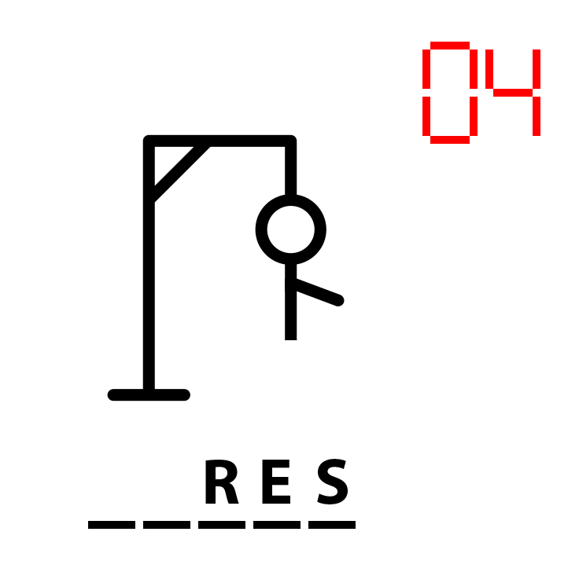
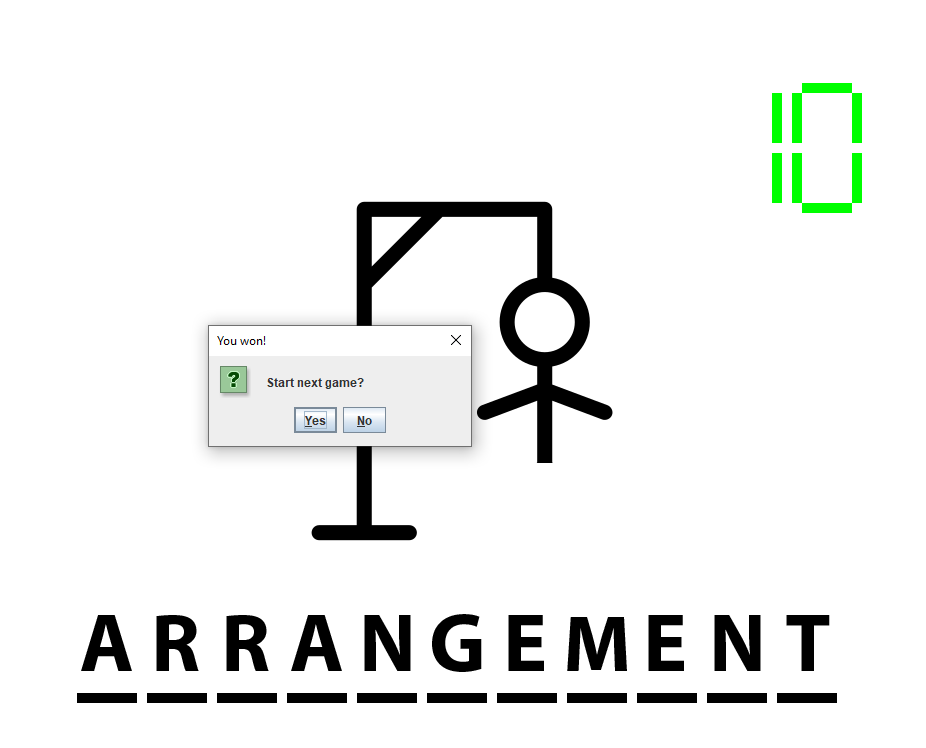
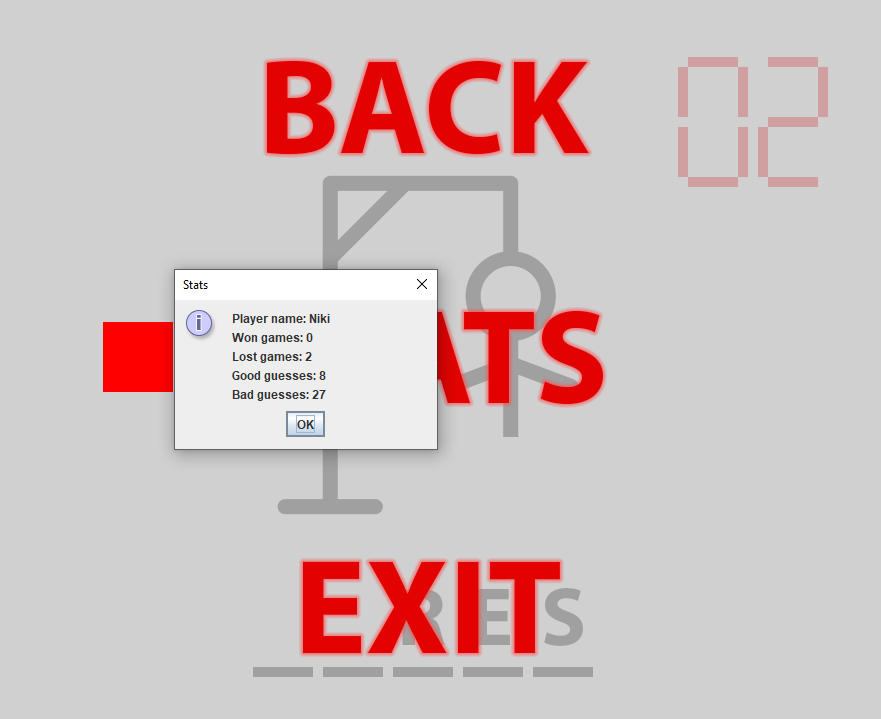

# Hangman
This project called Hangman was created to pass university course.

## How to play
- The game is played by guessing letters of a hidden word one at the time.
- At the start of the game the user is asked to enter their name.
- You have 10 seconds to guess a letter and 10 guesses to guess the word.
- When the timer has 5 seconds left it turns red.
- Every time you guess a correct letter that letter is then shown on screen.
- Otherwise, when you guess a wrong letter a new part is added to the hangman.
- Game ends either when the hidden word is guessed correctly or user runs out of guesses by building a complete hangman.
After that you can either start a new game or end the application.   

## Menu
By pressing the **Escape** key you can bring out a game menu and pause the game.
You can move the selection by pressing **Up** and **Down** arrow keys, confirm your choice by pressing **Enter** and close the menu
by selecting "BACK" or pressing **Escape**.  
You can see your stats by selecting "STATS" or exit the game by selecting "EXIT". 

## How to build
Add the provided JSON library to your IDE's libraries and run the main method in class Game.

## Words to guess
- The application needs `words.txt` to function. To this file you can add your own words to be guessed. 
- Words shouldn't be longer than 14 characters including spaces and should consist only of letters of English alphabet.
- Letters shown on screen are all capital so capitalization in this file doesn't matter.

## Stats
- Stats are loaded from `stats.json`
- After entering your name at the beginning of the game either all your stats will be at zero or 
when your name is found in the file those stats will be used. 
- The stats are saved before closing the application from within. If closed externally the stats may not be saved.

## Gameplay screenshots
#### Middle of the game

#### Game was won

#### Menu

#### User stats

### VERSION: 4.1.2022
### AUTHOR: SAl0nKA